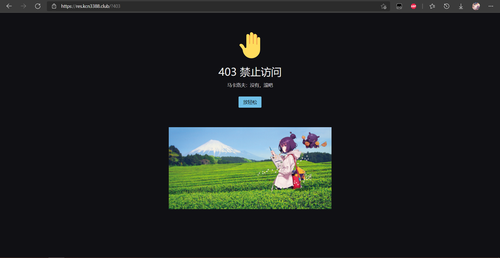
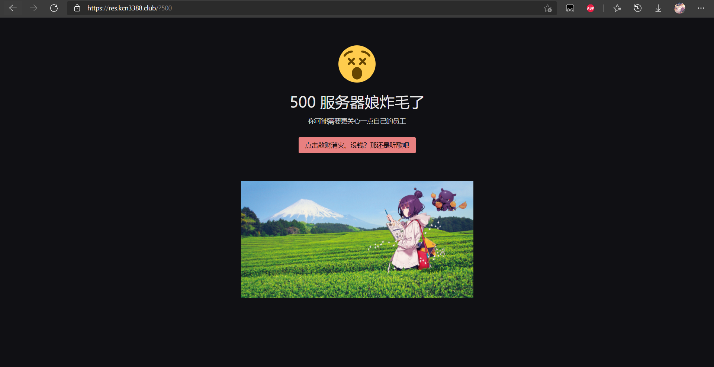
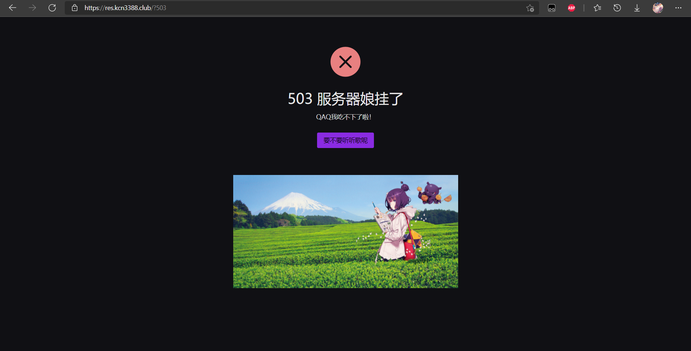
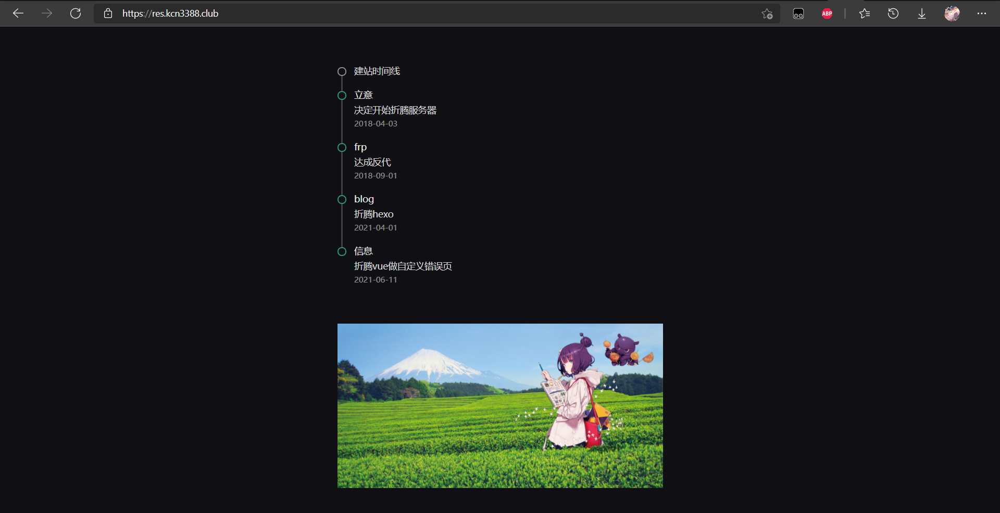

<h1 align="center">Naive-UI: Error page</h1>

<div align="center">

This is a personal customized error page for html error codes. Using [naive-ui](https://github.com/TuSimple/naive-ui), powered by[Vue3](https://github.com/vuejs/vue-next).

[Vue3 Docs](https://v3.vuejs.org/)

[naive-ui Docs](https://www.naiveui.com/en-US/dark)

🇨🇳 **[中文文档](https://github.com/kcn3388/Vue3-naive/blob/main/README_CN.md)** | **[更变日志]((https://github.com/kcn3388/Vue3-naive/blob/main/CHANGELOG_CN.md)**

<details>
<summary>Previews</summary>

[](https://res.kcn3388.club/?404)

[](https://res.kcn3388.club/?403)

[](https://res.kcn3388.club/?500)

[](https://res.kcn3388.club/?503)

</details>

</div>

## Project setup
```
yarn install
```

### Compiles and hot-reloads for development
```
yarn serve
```

### Compiles and minifies for production
```
yarn build
```

### Lints and fixes files
```
yarn lint
```

### Customize configuration

#### Homepage

Personaly using Timeline and my favorite img for home page, you can modify ``App.vue`` to have your on personal favorite. Here I recommend [naive-ui](https://www.naiveui.com/zh-CN/dark/components/button) for your components.

<details>
<summary>Example</summary>



</details>

#### Error page

The button under message can be modified to adapt different functions.

### 如何使用？

Using Apache as an example, find the followings in the config file, then uncomment necessary codes and add links for them.

```xml
# Some examples:
ErrorDocument 500 https://res.kcn3388.club/?500
ErrorDocument 404 https://res.kcn3388.club/?404
#ErrorDocument 404 "/cgi-bin/missing_handler.pl"
#ErrorDocument 402 http://www.example.com/subscription_info.html
ErrorDocument 503 https://res.kcn3388.club/?503
ErrorDocument 403 https://res.kcn3388.club/?403
```
