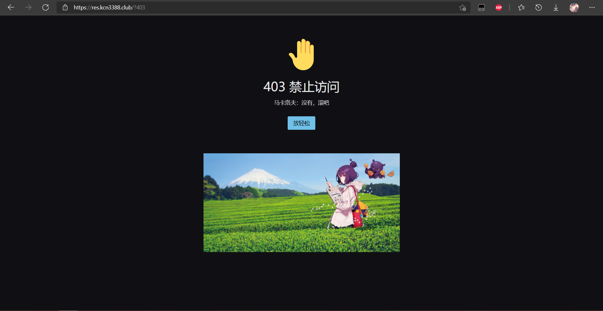
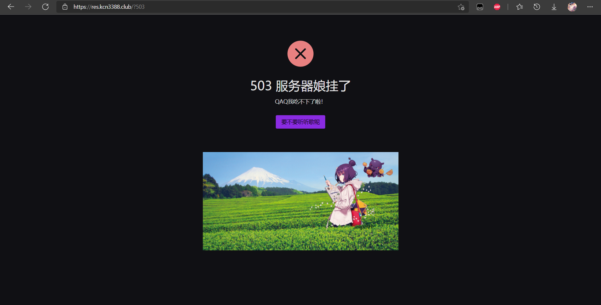

# naive

## 介绍

这是一个个人个性化网站错误页的小项目，使用[naive-ui](https://github.com/TuSimple/naive-ui)，由[Vue3](https://github.com/vuejs/vue-next)驱动。

[Vue3 中文文档](https://v3.cn.vuejs.org/)

[naive-ui 中文文档](https://www.naiveui.com/zh-CN/dark)

示例：[404](https://res.kcn3388.club/?404) [403](https://res.kcn3388.club/?403) [500](https://res.kcn3388.club/?500) [503](https://res.kcn3388.club/?503)

<details>
<summary>示例</summary>








</details>

## 初始化项目
```
yarn install
```

### 运行调试服务器
```
yarn serve
```

### 构建项目
```
yarn build
```

### Lints与修复
```
yarn lint
```

### 个性化设置

#### 首页

个人使用了Timeline + 喜欢的图片作为首页，可以自行修改``App.vue``以获得自己想要的效果。推荐使用[naive-ui 组件](https://www.naiveui.com/zh-CN/dark/components/button)。

<details>
<summary>示例</summary>


</details>

#### 错误页

在错误提示下方的按钮可以自定义功能。当前是跳转音乐界面。

### 如何使用？

以Apache为例，寻找到配置文件中下述字段，取消注释并填写链接。

```xml
# Some examples:
ErrorDocument 500 https://res.kcn3388.club/?500
ErrorDocument 404 https://res.kcn3388.club/?404
#ErrorDocument 404 "/cgi-bin/missing_handler.pl"
#ErrorDocument 402 http://www.example.com/subscription_info.html
ErrorDocument 503 https://res.kcn3388.club/?503
ErrorDocument 403 https://res.kcn3388.club/?403
```
